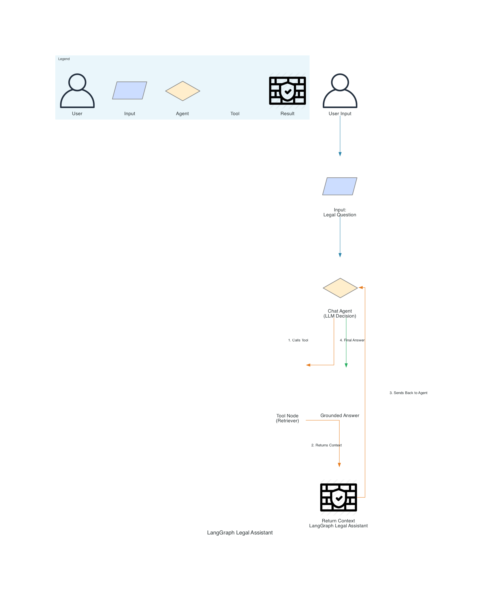

# 🧠 Agentic Legal Assistant

A LangGraph-powered multi-agent AI system for answering legal questions grounded in uploaded contracts. This system uses Retrieval-Augmented Generation (RAG) to extract and cite relevant sections from legal documents like contracts and agreements.

---

## ✅ Key Features

* Accepts natural language legal questions
* Parses uploaded PDF contracts
* Uses multi-agent LangGraph orchestration
* Retrieves relevant context with citations
* Returns grounded summaries using OpenAI GPT-4

---

## 🏗️ Architecture



> Nodes are color-coded:
> **🟦 Input**, **🟧 Tool**, **🟩 Result**, 🛡️ System Output
> **⬦ Diamond** = Agent decision logic (LLM), 📄 Parallelogram = user input/output, 👤 User

### Agent Workflow

1. **User Input**: A legal question is submitted.
2. **LLM Agent**: Decides whether tool assistance is required.
3. **Tool Node**: Retrieves context from vector DB.
4. **Agent**: Uses result to compose grounded, cited response.

---

### 🔁 LangGraph Flow (ASCII View)

```
+------------------+
|   User Input     |
+------------------+
      |
      v
+---------------------------+
|   Legal Question Input    |
+---------------------------+
      |
      v
+------------------------------+
| Chat Agent (LLM Decision)   |
+------------------------------+
      |---(1) Calls Tool--->
      v
+------------------------------+
|  Tool Node (Retriever)      |
+------------------------------+
      |---(2) Returns Context--->
      v
+------------------------------+
|  Return Context             |
+------------------------------+
      |---(3) Sends Back--->
      v
+------------------------------+
| Chat Agent                  |
+------------------------------+
      |---(4) Final Answer--->
      v
+------------------------------+
|  Grounded Answer            |
+------------------------------+
```

---

## 🧰 Tools Used

| Role             | Tool / Method                          |
| ---------------- | -------------------------------------- |
| Language Model   | OpenAI GPT-4 via LangChain             |
| Document Parsing | `PyPDFLoader`                          |
| Embedding        | `HuggingFaceEmbeddings`                |
| Retrieval        | `Chroma` vector store                  |
| Agent Framework  | `LangGraph`                            |
| Agent Logic      | `StateGraph`, `RunnableLambda`, Memory |

---

## 📓 Notebook Demo

Interactive walkthrough:
👉 [Colab Demo](https://colab.research.google.com/github/cbratkovics/agentic-legal-assistant/blob/main/agentic_legal_assistant_demo.ipynb)

Or run locally:

```bash
jupyter notebook agentic_legal_assistant_demo.ipynb
```

---

## 📄 Example Use Case

> “Does this contract allow early termination?”

✅ The assistant reads the contract, finds the termination clause, and returns a citation-backed answer.

---

## 🚀 Run Locally

### 1. Clone & Setup

```bash
git clone https://github.com/cbratkovics/agentic-legal-assistant.git
cd agentic-legal-assistant

# Create environment
conda create -n agentic python=3.10 -y
conda activate agentic

# Install dependencies
pip install -r requirements.txt
```

### 2. Run the Agent

```bash
python src/main.py --pdf contracts/sample_contract.pdf \
                   --questions "What are the payment terms?" "Is there a termination clause?"
```

Answers saved to: `outputs/qa_log.jsonl`

---

## 🧪 Example Output

```
Q: Does this contract allow early termination?
A: Yes, the contract includes a clause that allows either party to terminate with 30 days' notice. [Page 3]
```

---

## 🗂 Project Layout

```
agentic-legal-assistant/
├── contracts/                  ← Input PDFs
├── outputs/                    ← Saved Q&A logs + diagram
├── src/                        ← Core agent logic
├── agentic_legal_assistant_demo.ipynb
├── requirements.txt
├── README.md
└── architecture_diagram.png
```

---

## 🔐 API Key Setup

Set your OpenAI key in the environment:

```bash
export OPENAI_API_KEY=sk-xxxx
```

Or via `.env`:

```
OPENAI_API_KEY=sk-xxxx
```

Load in code with:

```python
from dotenv import load_dotenv
load_dotenv()
```

---

## 📦 `requirements.txt`

```txt
langchain
langgraph
chromadb
langchain-openai
langchain-huggingface
pypdf
ipywidgets
tqdm
python-dotenv
notebook
```

---

## 📌 TODO / Extensions

* [ ] `.docx` and `.txt` support
* [ ] Streamlit front-end
* [ ] Highlight source text
* [ ] Multi-document ingestion

---

## 📝 License

MIT License © 2025 Christopher Bratkovics
